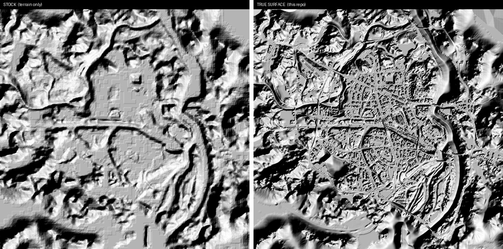
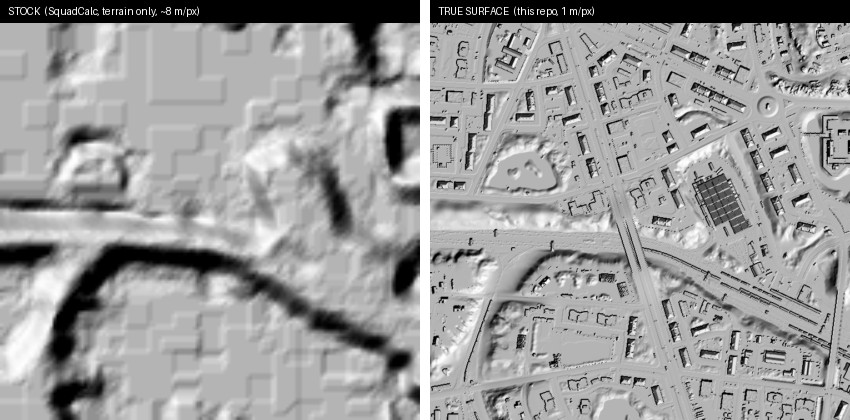

# SquadHeight

[](https://www.unrealengine.com/)
[](https://www.python.org/)
[](#requirements)
[](LICENSE)
[](https://ko-fi.com/metroseksuaali)

True-surface heightmap exporter for the Squad SDK (Unreal editor), built to get better maps to
[SquadCalc](https://github.com/sh4rkman/SquadCalc).

SquadCalc's current heightmaps come from the UE Landscape, which contains
terrain only. Buildings, bridges and rocks are missing, so elevation
calculations on or near structures are wrong. SquadHeight replaces that data
with a top-down ray-trace of the actual world collision: structures are
included, foliage (trees, bushes, landscape grass) is excluded. Re-exporting
after a map update is a single script run.



*Same map, hillshaded. Left: the stock terrain-only heightmap. Right: this
repo's true-surface scan — the entire city reads as real geometry. (Both
panels are renders for illustration; the actual data is plain JSON.)*

Verified working against the Squad SDK (UE5). A full 4 km map at 1 m
resolution takes about 6 minutes (~45k traces/s).

## Downloads — prebuilt heightmaps

If you just want the data, you don't need to run anything. The latest export of
all 26 maps is published under
[**Releases**](https://github.com/Metroseksuaali/SquadHeight/releases/latest):

* `squadcalc_heightmaps_500.zip` — the drop-in set, laid out as
  `img/maps/<map>/heightmap.json` (500×500, exactly SquadCalc's API layout).
  Start here.
* `heightmaps_1m_fullres.zip` — full 1 m resolution `heightmap.json` +
  `meta.json` per map.
* `heightmap_images_16bit_png.zip` — 16-bit grayscale inspection renders.

Format and the meaning of edge values are described below and in the
`NOTES.txt` inside each zip. Rebuild the zips after a fresh export with
`python tools/build_release_zips.py`.

> The downloads contain the **raw data** (`heightmap.json`) plus 16-bit
> **grayscale** inspection PNGs. The colorized/hillshaded images in this README
> are renders made for illustration (`tools/render_docs_images.py`), not part
> of the download.

## Quick start — export every map (step by step)

This is the headless route: it exports all configured maps to `output/`
without you babysitting the editor. Do this once per SDK/map update.

1. **Enable Python in the SDK editor.** Edit → Plugins → search "Python" →
   enable **Python Editor Script Plugin** → restart the editor. (Details and
   fallbacks under [Setup](#setup).)

2. **Tell the tool where your editor and project are.** Copy
   `settings.example.bat` to `settings.bat` and edit the two paths inside —
   the `UnrealEditor-Cmd.exe` for your SDK and your `SquadGame.uproject`.
   `settings.bat` is git-ignored, so your paths stay local.

3. **Generate the map list.** In the editor's Output Log, switch the input
   box from `Cmd` to `Python` and run
   `make_config.py` (see [Batch / headless export](#batch--headless-export)
   for the exact line). It scans the SDK and writes
   `tools/maps_config.json`, pairing each map with its SquadCalc bounds.
   Skim the file to check the picks.

4. **Run the export.** Double-click `run_batch_export.bat` (or run it from a
   terminal). It launches the editor headless and exports every map in the
   config. If the editor runs out of memory on a big map it relaunches and
   resumes — finished maps are skipped — so just let it run to the end.

5. **Collect the results.** Each map lands in `output/<MapName>/`
   (`heightmap.json` full-res, `heightmap_500.json` drop-in, `heightmap_16bit.png`,
   `heightmap_8bit.png`, `meta.json`). A final `output/batch_report.json` lists
   every map with OK / failed and timing.

6. **Check it before shipping (optional).** `squadcalc-test/` runs a local
   copy of SquadCalc against these files so you can see the elevation on the
   real maps — see [squadcalc-test/README.md](squadcalc-test/README.md).

### What you'll see while it runs

Progress is printed live — you are never left guessing:

* **Per map:** a header `===== [3/26] Chora =====` as each one starts, and its
  duration when it finishes.
* **Within a map** (the scan takes minutes at 1 m): a line every 25 rows, e.g.
  `row 1200/4065  (46000 traces/s, ETA 4m02s)` — current row, trace rate and
  estimated time left.
* **At the end:** `Batch finished: 24/26 ok in 446 s` plus a per-map summary.

In the headless `.bat` these stream in the console window (and into the
project's `Saved/Logs`). If you instead run a single map from inside the open
editor, you also get a graphical progress bar with a **Cancel** button.

## Read first — what the values mean at the edges

The scan covers the exact square SquadCalc stretches its heightmap over. A few
things follow from that, and matter when judging a map:

* **Water and out-of-play ground read as the map minimum (`0` after
  normalization).** This is correct: a flat sea surface is the right value for
  mortar math, and the lowest ground sits at 0 by definition.
* **Where the SDK map's landscape does not fill the whole minimap square, the
  uncovered border is `0`.** The *playable area is accurate*; only the
  out-of-play border lacks data. This is most visible on **Chora**, whose
  landscape is not square and leaves zero-filled bands outside the valley. We
  deliberately do **not** invent terrain there — extending the nearest edge
  would fabricate false plateaus (e.g. smear Chora's 150 m valley walls
  outward), which is worse than a flat minimum. If you already have full-square
  border data for such a map, prefer yours there and take ours for the
  playable interior, where the relief is truer (we measure real heights; the
  current data is often vertically compressed — e.g. Chora 150 m vs 32 m).
* **Heights are truer than the old Landscape data, including peaks.** Where the
  current heightmaps clip tall terrain to their maximum, ours keeps the real
  value (e.g. Skorpo peaks to ~1064 m, not ~557 m).

## Layout

```
run_batch_export.bat            headless batch export (edit paths at the top)
tools/
  export_heightmap.py           main exporter, runs inside the UE editor
  batch_export.py               loads each configured level and exports it
  maps_config.example.json      copy to maps_config.json and fill in levels
  squadcalc_bounds.json         exact SquadCalc minimap bounds for all maps
  compare_heightmaps.py         diff a new export against a legacy heightmap
  find_alignment.py             recover minimap bounds by image registration
  png16.py                      dependency-free 8/16-bit grayscale PNG writer
  _selftest.py                  offline tests (no Unreal needed)
plan_b_cpp/                     C++ commandlet skeleton (optional, see below)
```

## Output

Each export writes `output/<MapName>/`:

| file | description |
|---|---|
| `heightmap.json` | 2D JSON array of heights in meters, min normalized to 0, full resolution |
| `heightmap_500.json` | 500×500 nearest-neighbor downsample — drop-in replacement for SquadCalc's current files (written when `downsample_to: 500` is set) |
| `heightmap_16bit.png` | 16-bit grayscale render for inspection |
| `heightmap_8bit.png` | 8-bit grayscale render — smaller, lossier preview only |
| `meta.json` | bounds, resolution, z-offset, PNG scaling, trace statistics |

Heights are absolute world Z minus `z_offset_m` (stored in `meta.json`), so
`world_z = value + z_offset_m`. SquadCalc only needs elevation differences,
so the offset never matters in practice.

Note: SquadCalc currently hardcodes the heightmap size to 500×500
(`squadHeightmaps.js`, `this.width = 500`). The full-resolution file becomes
useful once that line reads the size from the loaded array instead
(`this.width = this.json.length`).



*A few Narva city blocks, hillshaded. Left: the stock terrain-only data
(~8 m per pixel) — blurry, no structures. Right: this repo's full 1 m data —
individual buildings, streets and walls. (Renders for illustration; the files
are plain elevation values.)*

## Map coverage — where maps live in the SDK

All current maps are exportable, but they live in two different places in
the Mod SDK (verified on Squad Editor Public Testing v10.5):

* **Classic maps** are under `/Game/Maps/...` as expected.
* **Newer and reworked maps ship as game-feature plugins** with their own
  content roots: the Al Basrah rework is `/Al_Basrah/Maps/...`, plus
  `/Harju/Maps/...`, `/BlackCoast/Maps/...` and `/SanxianIslands/Maps/...`.
  You can see these mount at editor startup
  (`Mounting Project plugin Al_Basrah` in the log).

Beware of legacy leftovers: `/Game/Maps/BASRAH_CITY` still contains the
**pre-rework** Al Basrah. Exporting it would produce heightmaps that are
wrong for the current game. `tools/make_config.py` knows about the plugin
roots and prefers them automatically.

## Requirements

<details>
<summary>What you need (and what you don't)</summary>

The core export pipeline has **no external dependencies** — it runs on the
Python that ships inside the Squad SDK editor and uses only the standard
library plus the bundled `tools/png16.py`. Nothing to `pip install` to export
maps.

| For | Needs |
|---|---|
| **Exporting maps** (`export_heightmap.py`, `batch_export.py`, `make_config.py`) | Squad SDK editor with the **Python Editor Script Plugin** enabled. No external Python packages. |
| **Offline alignment / analysis** (`find_alignment.py`, `compare_heightmaps.py`) | System Python 3.10+; `find_alignment.py` needs **numpy**. |
| **Doc / preview images** (`tools/render_docs_images.py`) | Python 3.10+, **numpy** and **Pillow**. |
| **Local SquadCalc test harness** (`squadcalc-test/`) | **Docker** (Node and the app build are containerized). |

Install the optional bits only if you use those tools:

```sh
pip install numpy pillow
```

</details>

## Setup

1. Enable the **Python Editor Script Plugin** in the SDK editor
   (Edit → Plugins → search "Python" → enable → restart). If the plugin
   window is locked down, add it to the `.uproject` by hand:

   ```json
   "Plugins": [ { "Name": "PythonScriptPlugin", "Enabled": true } ]
   ```

   or pass `-EnablePlugins=PythonScriptPlugin` on the command line.

2. No external Python packages are needed to export — everything runs on the
   editor's embedded Python. The only extras are for the optional offline
   tools; see [Requirements](#requirements).

## Exporting a map

Open the map in the SDK editor and let it load fully (the first load of a
map compiles shaders and can take 10+ minutes; later loads are fast).
Switch the Output Log input from `Cmd` to `Python` and run:

```python
import sys; sys.path.append("C:/path/to/SquadHeight/tools")
import export_heightmap
export_heightmap.run_export(overrides={
    "resolution_m": 1.0,
    "bounds_m": {"min_x": -2464, "max_x": 1600, "min_y": -2664, "max_y": 1400},
    "trace_top_margin_m": 500.0,
    "downsample_to": 500,
})
```

**Always take `bounds_m` from [tools/squadcalc_bounds.json](tools/squadcalc_bounds.json).**
Those are the exact world-space squares SquadCalc stretches its minimaps
over (extracted from SquadCalc's own `src/data/maps.js`); using anything else
shifts every elevation lookup. The example above is Chora.

A progress dialog with a Cancel button appears; rate and ETA are logged.
Tip: run once with `"resolution_m": 8.0` first — it finishes in seconds and
lets you sanity-check the output before the real export.

## Batch / headless export

1. Generate `tools/maps_config.json` by running `tools/make_config.py` in the
   editor's Python console (Cmd mode: `py ".../tools/make_config.py"`) — it
   scans the SDK's map assets and pairs them with the SquadCalc bounds.
   Review its picks, or copy `tools/maps_config.example.json` and fill in
   levels by hand.
2. Copy `settings.example.bat` to `settings.bat` and edit the paths (editor
   binary and `.uproject`). `settings.bat` stays out of the repo.
3. Run `run_batch_export.bat`. Maps are exported one by one; failures don't
   stop the batch and everything is summarized in `output/batch_report.json`.
   Master levels that keep their content in streaming sublevels are handled
   automatically (the runner force-loads all sublevels before tracing).

You can also run `py ".../tools/batch_export.py"` inside an open editor to
batch without going headless (useful if level streaming misbehaves in
commandlets).

## Adding a new map

<details>
<summary>Two small edits and a re-run — full steps</summary>

When Squad ships a new map, the pipeline is built to absorb it with almost no
work — finding the level and its sublevels, excluding foliage, attaching
streaming geometry, hole-filling and so on are all generic, not per-map. The
only thing the tool genuinely needs is the map's **bounds**: the exact
world-space square SquadCalc stretches its minimap over. That number comes
from SquadCalc itself, so the normal path is to wait until the map appears in
SquadCalc's `src/data/maps.js` (usually soon after the game update).

Then, two small edits and a re-run:

1. **Add the bounds.** Open the new map in SquadCalc's
   [`src/data/maps.js`](https://github.com/sh4rkman/SquadCalc/blob/master/src/data/maps.js),
   copy its `minimap.corner0` / `corner1`, and add one entry to
   [tools/squadcalc_bounds.json](tools/squadcalc_bounds.json) in the same
   shape as the others. This is what aligns every elevation lookup, so it is
   required and must come from SquadCalc, not be guessed.

2. **Add a name alias only if needed.** If the map's SDK folder name doesn't
   contain the SquadCalc name (e.g. the Al Basrah rework lived under
   `BASRAH_CITY`), add a one-line hint to `NAME_HINTS` in
   [tools/make_config.py](tools/make_config.py). If the names already match,
   skip this.

3. **Regenerate and export.** Run `make_config.py` in the editor (it finds the
   new World asset automatically, across `/Game/Maps` and any plugin content
   roots), skim that its pick is the real playable level, then run
   `run_batch_export.bat`. The new map exports alongside the rest.

What's handled for you with no extra code: streaming sublevels are attached
and forced visible, foliage and designer marker actors are excluded, holes are
filled, and the editor resumes if it runs out of memory. These were the hard
parts and they are already generic.

Two cases need a little more care:

* **The map isn't in SquadCalc yet.** There are no published bounds. You can
  let the exporter auto-detect bounds from the Landscape (`bounds_m: null`) for
  a rough look, but it will not line up with the eventual minimap. To derive
  the real square before SquadCalc does, register against the in-game minimap
  image with [tools/find_alignment.py](tools/find_alignment.py). This is the
  rare exception, not the normal flow.
* **A tilted minimap or unusual collision.** If a future map's minimap capture
  isn't world-axis-aligned, `find_alignment.py` reports the rotation; set
  `grid_rotation_deg` accordingly. Every current map is axis-aligned, so this
  is unlikely.

</details>

## Configuration

<details>
<summary>Show the settings that matter most</summary>

Everything lives in `CONFIG` at the top of
[tools/export_heightmap.py](tools/export_heightmap.py), commented in place.
The ones that matter most:

* `resolution_m` — grid spacing. 1.0 is the sweet spot; 0.5 quadruples the time.
* `bounds_m` — see above. `null` auto-detects from Landscape bounds, which is
  fine for inspection but does NOT match the SquadCalc minimap.
* `trace_top_margin_m` — use 500 on maps with tall surround mountains,
  otherwise rays can start inside the meshes and clip their tops.
* `trace.channel` — `Visibility` works on the Squad SDK. Configurable in case
  a future SDK changes collision setups.
* `surface_mode` — `topmost` (default): bridge decks and rooftops win over
  the ground beneath them, which is what mortar fire cares about.
  `terrain_under_overhang`: drops through any mesh with at least
  `overhang_min_clearance_m` of open space under it; correct under bridges
  but also drops building roofs to interior floors, so it's not the default.
* `grid_rotation_deg` — rotates the sample grid for maps whose minimap
  capture isn't world-axis-aligned. Every map listed in
  `squadcalc_bounds.json` is axis-aligned, so this stays 0 unless
  `find_alignment.py` says otherwise for a new map.

</details>

## How foliage is excluded

<details>
<summary>Show how trees and grass are skipped</summary>

1. Every `InstancedFoliageActor` (all painted foliage) goes on the trace
   ignore list, so rays pass through trees at zero cost.
2. Hits on foliage component classes and on landscape-grass instances are
   skipped and the ray continues downward.
3. Hits whose static-mesh asset path contains a configured keyword
   (default: `foliage`) are skipped — this catches hand-placed trees.

To verify on a new map: export at 8 m and check that forests look like
smooth ground in the PNG, not lumpy canopies. If trees leak through, click
one in the editor, read its mesh path and add a suitable substring to
`exclude_asset_path_keywords`.

</details>

## Validating an export

<details>
<summary>Show how to diff against a legacy heightmap</summary>

```
python tools/compare_heightmaps.py legacy_chora.json output/Chora/heightmap_500.json output/Chora/diff
```

Diffs a new export against the legacy SquadCalc file (grab one from the
SquadCalc repo/site). In `diff.png`, gray = unchanged, bright = new data is
higher. A correct export shows flat gray terrain with structures glowing —
buildings were flat ground in the old data. Note that legacy files pad the
area outside the playable zone with a constant value, which dominates naive
diff statistics; judge the playable area.

If you have a legacy heightmap but no bounds for a map (not listed in
`squadcalc_bounds.json`), `find_alignment.py` recovers the minimap square by
registering the legacy file against an axis-aligned scan — it searches
rotation, mirroring, scale and offset and prints ready-to-paste overrides:

```
python tools/find_alignment.py legacy.json output/MapName
python tools/find_alignment.py --selftest output/MapName   # verify the tool first
```

</details>

## Implementation notes

<details>
<summary>Show engine, seam, bridge and performance notes</summary>

* **Engine compatibility:** written for UE5 with UE4.27 fallbacks. Reading
  trace hits differs between engine versions, so the exporter detects a
  working strategy at runtime (`HitResult read strategy` in the log).
* **Landscape seam cracks:** rays can slip through hairline gaps between
  landscape streaming-proxy collision bodies, leaving thin no-hit lines.
  These cells are filled from their nearest valid neighbors automatically.
* **Bridges:** a 2.5D heightmap stores one value per cell, so a bridge and
  the road under it can't both exist. See `surface_mode` above.
* **Performance:** ~40–50k traces/s in editor Python on a typical machine.
  4 km @ 1 m ≈ 16.5M traces ≈ 6 minutes. The editor stays responsive. If
  that's ever too slow (e.g. 0.5 m batches over all maps),
  `plan_b_cpp/` contains a commandlet skeleton of the same algorithm in C++
  with `ParallelFor`, which is orders of magnitude faster but requires
  building an editor module against the SDK.

</details>

## Troubleshooting

<details>
<summary>Show common problems and fixes</summary>

* `-run=pythonscript` says unknown commandlet → the Python plugin isn't
  enabled (see Setup).
* "No Landscape actors found" → the map isn't fully loaded, or pass
  `bounds_m` manually.
* Flat output, no structures → wrong trace channel; try
  `trace: {"by": "profile", "profile": "BlockAll"}`.
* Mountain tops flattened at one exact height → increase
  `trace_top_margin_m`.
* The 16-bit PNG looks black → the gray range covers the full height span;
  tall surround mountains compress the playable area into a few gray levels.
  The data is fine — inspect `heightmap.json` or stretch the contrast.

</details>

## Support

If this saved you time or you'd like to support the work, you can buy me a
coffee — it's appreciated and never expected.

[](https://ko-fi.com/metroseksuaali)

Thanks to [SquadCalc](https://github.com/sh4rkman/SquadCalc) for the calculator
and for documenting the minimap bounds this exporter aligns to.

## License

* **Code** — the export tools in this repository are GNU Affero General Public License v3.0 licensed (see [LICENSE](LICENSE)). The repository itself contains only original source code; no game data is checked in.
* **Map data** — the exported heightmaps and images (published under
  [Releases](https://github.com/Metroseksuaali/SquadHeight/releases)) are a
  derivative of Squad, © Offworld Industries, produced with the official Mod
  SDK. They are **not** covered by the AGPL license. Squad and its assets are
  the property of Offworld Industries; this is an unofficial community project,
  not affiliated with or endorsed by OWI, shared for use with tools like
  SquadCalc and subject to OWI's EULA and modding terms.
